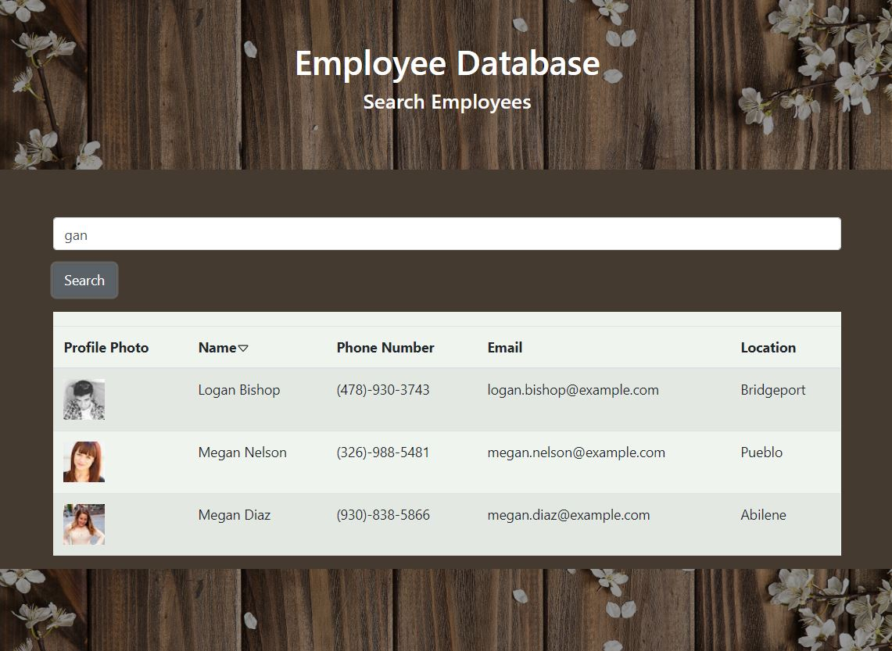

# Employee Directory
This Employee Directory is populated with a [random user database](https://randomuser.me/api/?results=200&nat=us) and built using [React](https://reactjs.org/docs/getting-started.html), [Axios](https://www.npmjs.com/package/react-axios), and [Bootstrap](https://getbootstrap.com/).

The searchbar will match fragments of the employee's name or phone number, or perfect matches, when you click the search button.

To revert back to the initial employee list, clear the searchbar and click search again.

The Name column will sort alphabetically when clicked.

## Installation 
Fork the repository.
Once open in Visual Studio Code, open a terminal at the root of the project directory, and run:

 `npm install `

and

  `npm install axios react-router-dom bootstrap` 
  

## Example

## Links

[Deployment]coming soon

[Repository](https://github.com/B-Audette/react_directory)

## Collaborators
This project was worked on with assistance from:

[Amanda Anderson](https://github.com/aanderson120)

[Lindsey Bordner](//https://github.com/LindseyM20)

Kevin Ferguson

